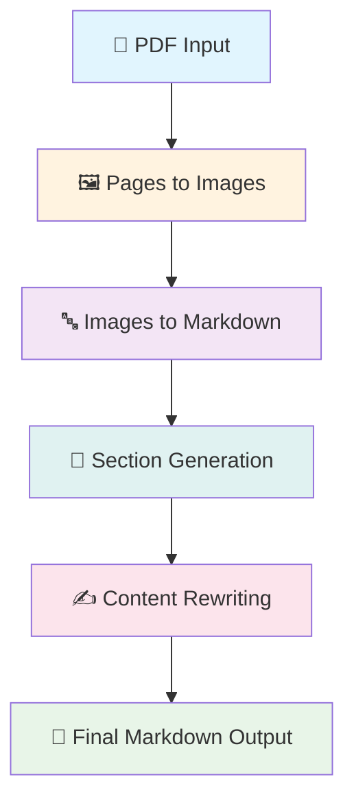

# 📝 Handwritten Notes Converter

> **Transform your handwritten notes into beautiful, structured Markdown with the power of AI**

[](https://python.org)
[](https://azure.microsoft.com)
[](https://langchain.com)

## ✨ What is this?

Ever wished you could instantly convert your handwritten notes into perfectly formatted digital documents? This intelligent system leverages cutting-edge AI to transform PDF files containing handwritten content into clean, structured Markdown format - complete with proper sections, mathematical formulas, tables, and diagrams!

## 🚀 Key Features

- 🖼️ **Smart PDF Processing**: Converts PDF pages to high-quality images
- 🧠 **AI-Powered OCR**: Uses Azure OpenAI to intelligently extract text from handwritten content
- 📚 **Automatic Structuring**: Identifies and organizes content into logical sections
- ✍️ **Content Enhancement**: Rewrites extracted content for clarity and readability
- 🔢 **Formula Support**: Preserves mathematical equations in LaTeX format
- 📊 **Table Recognition**: Converts handwritten tables to Markdown format
- 🎨 **Diagram Conversion**: Transforms block diagrams into Mermaid syntax

## 🏗️ Architecture Overview

The system follows a sophisticated 4-stage pipeline that transforms raw handwritten PDFs into polished Markdown documents:



## 🔧 Core Components

### 1. 📖 Pages to Images (`pages_to_images.py`)
**Purpose**: Converts PDF pages into processable image format

```python
class PagesToImages:
    def convert(self, input: PagesToImagesInput) -> PagesToImagesOutput
```

**What it does**:
- 🎯 Extracts each page from the PDF as a high-resolution image
- 💾 Optionally saves images to disk for debugging
- 🔄 Converts images to base64 format for AI processing
- 📏 Handles proper page numbering with zero-padding

**Key Features**:
- Uses PyMuPDF for reliable PDF processing
- Generates base64-encoded images for seamless AI integration
- Smart page numbering format based on total page count

### 2. 🤖 Images to Markdown (`images_to_markdown.py`)
**Purpose**: Transforms handwritten images into structured Markdown text

```python
class ImagesToMarkdown:
    def convert(self, input: ImagesToMarkdownInput) -> ImagesToMarkdownOutput
```

**What it does**:
- 🔍 Analyzes each image using Azure OpenAI's vision capabilities
- 📝 Extracts handwritten text with high accuracy
- 🧮 Preserves mathematical formulas in LaTeX syntax
- 📊 Converts tables to proper Markdown format
- 🎨 Transforms diagrams into Mermaid syntax

**AI Magic**:
- Specialized system prompt for handwritten note recognition
- Handles unclear content with intelligent best-guess annotations
- Maintains original structure and formatting intent

### 3. 📚 Section Generator (`section_generator.py`)
**Purpose**: Intelligently organizes content into logical sections

```python
class SectionGenerator:
    def generate(self, input: SectionGeneratorInput) -> SectionGeneratorOutput
```

**What it does**:
- 🔍 **Table of Contents Detection**: Scans for existing TOC or creates one based on content structure
- ✂️ **Smart Chunking**: Breaks large documents into manageable pieces
- 🏷️ **Section Extraction**: Identifies and separates content by topics
- 🔗 **Content Linking**: Maintains relationships between sections

**Advanced Features**:
- **TOC Extractor**: Finds implicit table of contents even without explicit headers
- **Section Extractor**: Uses AI to intelligently split content at natural boundaries
- **Chunk Management**: Handles large documents by processing in optimal-sized chunks

### 4. ✨ Section Rewriter (`re_writer.py`)
**Purpose**: Enhances extracted content for clarity and readability

```python
class SectionRewriter:
    def rewrite(self, input: SectionRewriteInput) -> SectionRewriteOutput
```

**What it does**:
- 📖 **Content Enhancement**: Transforms raw extracted text into textbook-quality prose
- 🎯 **Clarity Improvement**: Adds explanations and examples where needed
- 🔧 **Error Correction**: Fixes LaTeX formulas, code blocks, and diagram syntax
- 📐 **Format Standardization**: Ensures consistent Markdown formatting

**Quality Assurance**:
- Maintains all original information while improving readability
- Adds contextual explanations without changing core meaning
- Ensures proper syntax for all technical content

### 5. 🎛️ Main Converter (`converter.py`)
**Purpose**: Orchestrates the entire conversion pipeline

```python
class HandwrittenNotesConverter:
    def convert(self, input: HandwrittenNotesConverterInput) -> None
```

**What it does**:
- 🔄 **Pipeline Orchestration**: Manages the 4-stage conversion process
- 📁 **File Management**: Handles input/output file operations
- 🎯 **Error Handling**: Ensures robust processing through all stages
- 💾 **Output Generation**: Creates the final enhanced Markdown document

## 📋 Usage Examples

### Basic Usage
```python
from agent.converter import HandwrittenNotesConverter, HandwrittenNotesConverterInput

# Initialize the converter
converter = HandwrittenNotesConverter()

# Set up input parameters
input_config = HandwrittenNotesConverterInput(
    str_inputPath="my_handwritten_notes.pdf",
    str_outputPath="./output"
)

# Convert your notes!
converter.convert(input_config)
# Result: ./output/final_notes.md
```

### Individual Component Usage
```python
# Convert PDF to images only
from agent.pages_to_images import PagesToImages, PagesToImagesInput

converter = PagesToImages()
images = converter.convert(PagesToImagesInput(
    str_inputPath="notes.pdf",
    str_outputPath="./images",
    bool_saveImages=True
))

# Extract text from specific images
from agent.images_to_markdown import ImagesToMarkdown, ImagesToMarkdownInput

markdown_converter = ImagesToMarkdown()
markdown = markdown_converter.convert(ImagesToMarkdownInput(
    list_images=images.list_images
))
```

## 🧪 Testing Suite

The project includes comprehensive tests that demonstrate each component:

### Test Coverage
- **`test_pdf_to_images_convert()`**: Validates PDF to image conversion
- **`test_images_to_markdown_convert()`**: Tests AI-powered text extraction
- **`test_section_generator_generate()`**: Verifies section organization
- **`test_section_rewriter_rewrite()`**: Confirms content enhancement
- **`test_raw_section_conversion()`**: Validates individual section processing

### Running Tests
```bash
# Run all tests
pytest

# Run specific test
pytest tests/test_pdf_to_image.py::test_pdf_to_images_convert

# Run with verbose output
pytest -v
```

## ⚙️ Configuration Requirements

### Environment Variables
```bash
# Azure OpenAI Configuration
AZURE_DEPLOYEMENT_GENERIC=your-general-deployment-name
DEPLOYEMENT_REASONING=your-reasoning-deployment-name
```

### Dependencies
```bash
pip install -r requirements.txt
```

**Core Dependencies**:
- `pymupdf4llm`: PDF processing and image extraction
- `pydantic`: Data validation and serialization
- `langchain-openai`: Azure OpenAI integration
- `pytest`: Testing framework

## 🎯 Use Cases

### 📚 Academic Notes
- Convert handwritten lecture notes into digital study materials
- Preserve mathematical formulas and diagrams
- Create searchable, shareable content

### 💼 Business Documentation
- Digitize handwritten meeting notes
- Convert whiteboard sketches into formal documentation
- Archive important handwritten records

### 🔬 Research Papers
- Transform handwritten research notes into structured documents
- Preserve complex equations and technical diagrams
- Create collaborative, editable research materials

## 🚧 Data Flow

```
📄 Input PDF
    ↓
🖼️ Extract Pages as Images (base64)
    ↓
🤖 AI Vision Analysis
    ↓ 
📝 Raw Markdown Content
    ↓
🔍 Identify Table of Contents
    ↓
✂️ Split into Logical Sections
    ↓
✨ Enhance Content Quality
    ↓
📋 Final Structured Markdown
```

## 🎨 Output Quality

The system produces high-quality output with:

- **📖 Textbook-level writing**: Enhanced clarity and readability
- **🔢 Preserved mathematics**: LaTeX formulas maintained accurately
- **📊 Structured tables**: Clean Markdown table formatting
- **🎨 Visual diagrams**: Mermaid syntax for technical drawings
- **🏷️ Logical organization**: Intelligent section structuring

## 🤝 Contributing

We welcome contributions! Areas for improvement:

- 🌍 **Multi-language support**: Extend beyond English handwriting
- 🎨 **Enhanced diagram recognition**: Support for more diagram types
- ⚡ **Performance optimization**: Faster processing for large documents
- 🔧 **Configuration options**: More customizable processing parameters

## 📜 License

This project is designed to make handwritten content accessible and searchable in the digital age. Perfect for students, researchers, and professionals who want to bridge the gap between analog note-taking and digital documentation.

---

**Ready to transform your handwritten notes?** 🚀 Get started by following the setup instructions above!