# 📝 Handwritten Notes Converter

> **Transform your handwritten notes into beautiful, structured Markdown with the power of AI**

[](https://python.org)
[](https://azure.microsoft.com)
[](https://langchain.com)

## ✨ What is this?

Ever wished you could instantly convert your handwritten notes into perfectly formatted digital documents? This intelligent system leverages cutting-edge AI to transform PDF files containing handwritten content into clean, structured Markdown format - complete with proper sections, mathematical formulas, tables, and diagrams!

## 🚀 Key Features

- 🖼️ **Smart PDF Processing**: Converts PDF pages to high-quality images
- 🧠 **AI-Powered OCR**: Uses Azure OpenAI to intelligently extract text from handwritten content
- 📚 **Automatic Structuring**: Identifies and organizes content into logical sections
- ✍️ **Enhanced Content Rewriting**: Intelligent content enhancement with external resource integration
- 🌐 **Knowledge Enrichment**: Automatically fetches relevant Wikipedia and academic resources
- 🎯 **Topic-Aware Enhancement**: Identifies key topics and enriches content with additional context
- 🔢 **Formula Support**: Preserves mathematical equations in LaTeX format
- 📊 **Table Recognition**: Converts handwritten tables to Markdown format
- 🎨 **Diagram Conversion**: Transforms block diagrams into Mermaid syntax

## 🏗️ Architecture Overview

The system follows a sophisticated 5-stage pipeline that transforms raw handwritten PDFs into polished, knowledge-enriched Markdown documents:

```mermaid
graph TD
    A[📄 PDF Input] --> B[🖼️ Pages to Images]
    B --> C[🔤 Images to Markdown]
    C --> D[📑 Section Generation]
    D --> E[🌐 Resource Fetching]
    E --> F[✍️ Enhanced Rewriting]
    F --> G[📝 Final Markdown Output]
    
    style A fill:#e1f5fe
    style G fill:#e8f5e8
    style B fill:#fff3e0
    style C fill:#f3e5f5
    style D fill:#e0f2f1
    style E fill:#fff8e1
    style F fill:#fce4ec
```



## 🔧 Core Components

### 1. 📖 Pages to Images (`pages_to_images.py`)
**Purpose**: Converts PDF pages into processable image format

```python
class PagesToImages:
    def convert(self, input: PagesToImagesInput) -> PagesToImagesOutput
```

**What it does**:
- 🎯 Extracts each page from the PDF as a high-resolution image
- 💾 Optionally saves images to disk for debugging
- 🔄 Converts images to base64 format for AI processing
- 📏 Handles proper page numbering with zero-padding

**Key Features**:
- Uses PyMuPDF for reliable PDF processing
- Generates base64-encoded images for seamless AI integration
- Smart page numbering format based on total page count

### 2. 🤖 Images to Markdown (`images_to_markdown.py`)
**Purpose**: Transforms handwritten images into structured Markdown text

```python
class ImagesToMarkdown:
    def convert(self, input: ImagesToMarkdownInput) -> ImagesToMarkdownOutput
```

**What it does**:
- 🔍 Analyzes each image using Azure OpenAI's vision capabilities
- 📝 Extracts handwritten text with high accuracy
- 🧮 Preserves mathematical formulas in LaTeX syntax
- 📊 Converts tables to proper Markdown format
- 🎨 Transforms diagrams into Mermaid syntax

**AI Magic**:
- Specialized system prompt for handwritten note recognition
- Handles unclear content with intelligent best-guess annotations
- Maintains original structure and formatting intent

### 3. 📚 Section Generator (`section_generator.py`)
**Purpose**: Intelligently organizes content into logical sections

```python
class SectionGenerator:
    def generate(self, input: SectionGeneratorInput) -> SectionGeneratorOutput
```

**What it does**:
- 🔍 **Table of Contents Detection**: Scans for existing TOC or creates one based on content structure
- ✂️ **Smart Chunking**: Breaks large documents into manageable pieces
- 🏷️ **Section Extraction**: Identifies and separates content by topics
- 🔗 **Content Linking**: Maintains relationships between sections

**Advanced Features**:
- **TOC Extractor**: Finds implicit table of contents even without explicit headers
- **Section Extractor**: Uses AI to intelligently split content at natural boundaries
- **Chunk Management**: Handles large documents by processing in optimal-sized chunks

### 4. 🌐 Resource Fetcher (`resource_fetcher.py`)
**Purpose**: Intelligently enriches content with external knowledge sources

```python
class ResourceFetcher:
    def fetch_resources(self, input: ResourceFetcherInput) -> ResourceFetcherOutput
```

**What it does**:
- 🎯 **Topic Extraction**: Automatically identifies key topics from handwritten content
- 📚 **Wikipedia Integration**: Fetches relevant Wikipedia articles for each topic
- 🔬 **Academic Resources**: Retrieves scholarly content from academic databases
- 🧠 **Content Synthesis**: Combines handwritten notes with external knowledge
- 🎨 **Contextual Enhancement**: Enriches content while preserving original structure

**Advanced Components**:
- **TopicsFetcher**: AI-powered extraction of relevant topics (limited to 10 most important)
- **WikiPediaFetcher**: Retrieves comprehensive Wikipedia content for each topic
- **ArxivFetcher**: Accesses academic papers and research content (extensible)
- **TopicRewriter**: Synthesizes handwritten notes with external resources

**Smart Features**:
- Limits topic extraction to prevent information overload
- Prioritizes topics most relevant to the handwritten content
- Maintains academic rigor in content enhancement
- Preserves original intent while adding valuable context

### 5. ✨ Enhanced Section Rewriter (`re_writer.py`)
**Purpose**: Creates textbook-quality content with integrated external knowledge

```python
class SectionRewriter:
    def rewrite(self, input: SectionRewriteInput) -> SectionRewriteOutput
```

**What it does**:
- 📖 **Knowledge Integration**: Combines handwritten notes with fetched external resources
- 🎯 **Academic Excellence**: Produces Master's/PhD-level textbook content
- 🔧 **Error Correction**: Fixes LaTeX formulas, code blocks, and diagram syntax
- 📐 **Format Standardization**: Ensures consistent academic Markdown formatting
- 🌟 **Content Enrichment**: Adds explanations, examples, and detailed context

**Enhanced Capabilities**:
- **Resource-Aware Rewriting**: Leverages external knowledge for comprehensive explanations
- **Academic Tone**: Maintains scholarly writing suitable for advanced students
- **Technical Accuracy**: Ensures all equations and formulas are correctly formatted
- **Contextual Depth**: Provides detailed explanations with supporting evidence

### 6. 🎛️ Main Converter (`converter.py`)
**Purpose**: Orchestrates the entire enhanced conversion pipeline

```python
class HandwrittenNotesConverter:
    def convert(self, input: HandwrittenNotesConverterInput) -> None
```

**What it does**:
- 🔄 **Pipeline Orchestration**: Manages the 5-stage enhanced conversion process
- 📁 **File Management**: Handles input/output file operations
- 🎯 **Error Handling**: Ensures robust processing through all stages
- 💾 **Output Generation**: Creates the final knowledge-enriched Markdown document

## 📋 Usage Examples

### Basic Usage
```python
from agent.converter import HandwrittenNotesConverter, HandwrittenNotesConverterInput

# Initialize the converter
converter = HandwrittenNotesConverter()

# Set up input parameters
input_config = HandwrittenNotesConverterInput(
    str_inputPath="my_handwritten_notes.pdf",
    str_outputPath="./output"
)

# Convert your notes!
converter.convert(input_config)
# Result: ./output/final_notes.md
```

### Individual Component Usage
```python
# Convert PDF to images only
from agent.pages_to_images import PagesToImages, PagesToImagesInput

converter = PagesToImages()
images = converter.convert(PagesToImagesInput(
    str_inputPath="notes.pdf",
    str_outputPath="./images",
    bool_saveImages=True
))

# Extract text from specific images
from agent.images_to_markdown import ImagesToMarkdown, ImagesToMarkdownInput

markdown_converter = ImagesToMarkdown()
markdown = markdown_converter.convert(ImagesToMarkdownInput(
    list_images=images.list_images
))
```

## 🌟 Knowledge Enhancement Features

### 🧠 Intelligent Topic Extraction
The system automatically identifies key topics from your handwritten notes and enriches them with comprehensive external knowledge:

```python
# Automatic topic identification and resource fetching
from agent.resource_fetcher import ResourceFetcher, ResourceFetcherInput

fetcher = ResourceFetcher()
resources = fetcher.fetch_resources(ResourceFetcherInput(
    str_content="Your handwritten content about machine learning"
))

# Results in enriched content with:
# - Wikipedia articles on machine learning concepts
# - Academic context and explanations
# - Enhanced formulas and definitions
```

### 📚 Multi-Source Knowledge Integration
- **Wikipedia Integration**: Comprehensive encyclopedic knowledge
- **Academic Resources**: Scholarly content and research papers
- **Smart Synthesis**: AI combines handwritten notes with external sources
- **Topic Limitation**: Focuses on top 10 most relevant topics to prevent information overload

### 🎯 Academic Quality Enhancement
The enhanced rewriter creates content suitable for:
- **Master's Level Coursework**: Advanced explanations and context
- **PhD Research**: Comprehensive technical details and references
- **Professional Documentation**: Industry-standard formatting and clarity

## 🧪 Testing Suite

The project includes comprehensive tests that demonstrate each component:

### Test Coverage
- **`test_pdf_to_images_convert()`**: Validates PDF to image conversion
- **`test_images_to_markdown_convert()`**: Tests AI-powered text extraction
- **`test_section_generator_generate()`**: Verifies section organization
- **`test_section_rewriter_rewrite()`**: Confirms content enhancement
- **`test_raw_section_conversion()`**: Validates individual section processing

### Running Tests
```bash
# Run all tests
pytest

# Run specific test
pytest tests/test_pdf_to_image.py::test_pdf_to_images_convert

# Run with verbose output
pytest -v
```

## ⚙️ Configuration Requirements

### Environment Variables
```bash
# Azure OpenAI Configuration
AZURE_DEPLOYEMENT_GENERIC=your-general-deployment-name
DEPLOYEMENT_REASONING=your-reasoning-deployment-name
```

### Dependencies
```bash
pip install -r requirements.txt
```

**Core Dependencies**:
- `pymupdf4llm`: PDF processing and image extraction
- `pydantic`: Data validation and serialization
- `langchain-openai`: Azure OpenAI integration
- `langchain-community`: Wikipedia and external resource retrieval
- `pytest`: Testing framework

## 🎯 Use Cases

### 📚 Academic Notes
- Convert handwritten lecture notes into digital study materials
- Preserve mathematical formulas and diagrams
- Create searchable, shareable content

### 💼 Business Documentation
- Digitize handwritten meeting notes
- Convert whiteboard sketches into formal documentation
- Archive important handwritten records

### 🔬 Research Papers
- Transform handwritten research notes into structured documents
- Preserve complex equations and technical diagrams
- Create collaborative, editable research materials

## 🚧 Enhanced Data Flow

```
📄 Input PDF
    ↓
🖼️ Extract Pages as Images (base64)
    ↓
🤖 AI Vision Analysis
    ↓ 
📝 Raw Markdown Content
    ↓
🔍 Identify Table of Contents
    ↓
✂️ Split into Logical Sections
    ↓
🎯 Extract Key Topics per Section
    ↓
🌐 Fetch Wikipedia & Academic Resources
    ↓
🧠 Synthesize Notes with External Knowledge
    ↓
✨ Enhanced Academic-Quality Content
    ↓
📋 Final Knowledge-Enriched Markdown
```

## 🎨 Enhanced Output Quality

The system produces exceptionally high-quality output with:

- **📖 Academic-level writing**: Master's/PhD textbook quality with comprehensive explanations
- **🌐 Knowledge integration**: Enriched with relevant Wikipedia and academic content
- **🔢 Preserved mathematics**: LaTeX formulas maintained and enhanced with context
- **📊 Structured tables**: Clean Markdown table formatting with explanations
- **🎨 Visual diagrams**: Mermaid syntax for technical drawings with descriptions
- **🏷️ Intelligent organization**: Topic-aware section structuring
- **🎯 Contextual depth**: External resources seamlessly integrated with original content
- **🔬 Academic rigor**: Scholarly references and detailed explanations

## 🤝 Contributing

We welcome contributions! Areas for improvement:

- 🌍 **Multi-language support**: Extend beyond English handwriting
- 🎨 **Enhanced diagram recognition**: Support for more diagram types
- ⚡ **Performance optimization**: Faster processing for large documents
- 🔧 **Configuration options**: More customizable processing parameters
- 📚 **Additional knowledge sources**: Integration with more academic databases
- 🔬 **arXiv integration**: Complete implementation of scholarly paper retrieval
- 🎯 **Topic refinement**: Advanced topic extraction and relevance scoring
- 🌐 **Multi-source synthesis**: Enhanced integration of multiple knowledge sources

## 📜 License

This project is designed to make handwritten content accessible and searchable in the digital age, while enriching it with comprehensive knowledge from external sources. Perfect for students, researchers, and professionals who want to bridge the gap between analog note-taking and digital documentation with academic-grade enhancement.

---

**Ready to transform your handwritten notes?** 🚀 Get started by following the setup instructions above!